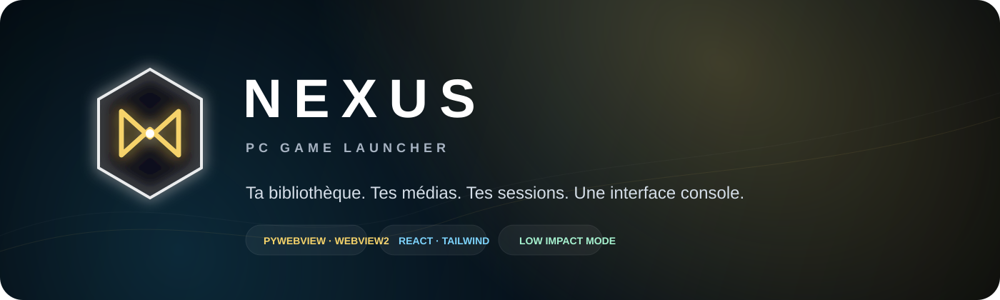

<div align="center">
  

  <br />

  **Launcher PC cinématique, local-first et pensé pour la manette.**  
  Bibliothèque unifiée · SteamGridDB · trailers Steam · succès Steam · suivi réel des sessions · mode faible impact.

  
  
  
  
  
</div>

---

## Ce que Nexus fait

Nexus transforme une bibliothèque Windows en interface de console sans lancer un deuxième navigateur lourd à côté du jeu. L'UI reste la création visuelle du projet, tandis que le backend natif est assuré par **Python + pywebview + WebView2**.

- **Import immédiat** depuis un `.exe` ou un scan Steam / Epic / GOG.
- **Identification automatique** du jeu, y compris recherche Steam prudente pour les imports non-Steam.
- **SteamGridDB** pour cover verticale, Hero/background, logo et icône.
- **Steam Store** pour métadonnées, screenshots et trailer, ensuite mis en cache local.
- **Steam Web API** pour les vrais succès et leur rareté lorsque le profil/API le permet.
- **Sessions réelles** enregistrées dans SQLite : durée, dernière session, total de jeu, statistiques mensuelles.
- **Navigation manette** et clavier, recherche, collections, favoris, fiche jeu et lecteur de trailer.
- **Séquence de lancement Nexus** plein écran, inspirée du niveau de finition des consoles modernes mais entièrement originale.
- **Nexus Spatial SFX** généré localement avec Web Audio : airy/glass/spatial, sans samples de console copiés.

## Mode faible impact

Quand un jeu démarre, Nexus peut automatiquement :

1. terminer sa séquence de lancement ;
2. masquer complètement la fenêtre WebView ;
3. suspendre ses SFX ;
4. placer le processus Python en priorité **Below Normal** et les helpers WebView2 en **Idle** ;
5. ne conserver qu'un moniteur de processus très léger pour mesurer la session ;
6. restaurer la fenêtre et les priorités quand le jeu se ferme.

Il n'y a **aucun scan permanent**, aucun téléchargement média pendant une partie, et aucun polling réseau de fond. Les médias sont téléchargés lors de l'import ou d'un rafraîchissement demandé.

## Pipeline d'ajout d'un jeu

```text
.exe / Steam / Epic / GOG
        │
        ▼
 identification locale
        │
        ├── Steam Store ──► nom · description · genres · screenshots · trailer
        │
        ├── SteamGridDB ──► cover · hero · logo · icon
        │
        └── Steam Web API ► achievements · rareté
        │
        ▼
 %LOCALAPPDATA%/NexusLauncher/media/<game-id>/
        │
        ▼
 SQLite + manifeste sauvegardés au fur et à mesure
```

Chaque média téléchargé est persisté immédiatement. Un import interrompu ne jette donc pas tout ce qui a déjà été récupéré.

## Clés API

Les clés se configurent dans **Paramètres → Médias & API** et restent dans le profil Windows local de Nexus.

| Service | Obligatoire | Utilisation |
|---|---:|---|
| SteamGridDB | Recommandé | Covers, Hero, logos, icônes |
| Steam Web API | Facultatif | Succès personnels Steam |
| SteamID64 | Facultatif | Associer le compte pour les succès |
| Steam Store | Non | Métadonnées, screenshots et trailers publics |

Sans SteamGridDB, les jeux Steam disposent encore de fallbacks d'assets publics Steam. Sans Steam Web API, le launcher fonctionne normalement, simplement sans synchronisation des succès personnels.

## Architecture

```text
src/                    React + TypeScript + Tailwind
├── components/         Hero, rail, modales, launch overlay, console UI
├── views/              Home, bibliothèque, collections, succès, stats, réglages
├── services/           bridge natif, analytics, manette, Spatial SFX
└── store/              état de l'interface

backend/                Python natif
├── api.py              bridge JS ↔ Python
├── sources.py          scan Steam / Epic / GOG / EXE
├── providers.py        Steam Store / SteamGridDB / Steam Web API
├── launcher.py         lancement, suivi process, mode faible impact
├── storage.py          SQLite + sessions + réglages
└── main.py             fenêtre pywebview / WebView2
```

Plus de détails dans [`docs/architecture.md`](docs/architecture.md) et [`docs/performance.md`](docs/performance.md).

## Développement Windows

Prérequis : **Node.js 22+**, **Python 3.12+**, le runtime **Microsoft Edge WebView2** et PowerShell.

```powershell
./scripts/dev_windows.ps1
```

## Construire l'EXE

```powershell
./scripts/build_windows.ps1
```

Sortie attendue :

```text
build/release/NexusLauncher.exe
```

La GitHub Action `.github/workflows/windows-release.yml` reproduit la build sur `windows-latest`, exécute les tests et publie automatiquement l'EXE.

## Tests

```powershell
python -m pytest -q
npm run lint
npm run build
```

## Vie privée

Nexus est **local-first**. Bibliothèque, sessions, médias et réglages sont stockés dans `%LOCALAPPDATA%\NexusLauncher`. Il n'y a pas de compte Nexus, pas de télémétrie maison et pas de serveur Nexus nécessaire au lancement d'un jeu.

## État de la release

Le code source et les tests backend sont prêts. La validation finale du binaire Windows doit être effectuée par la CI Windows ou sur une machine Windows avant de considérer le tag `v1.0.0` comme stable.

---

<div align="center">
  <sub>Nexus n'est affilié ni à Valve, SteamGridDB, Epic Games, GOG, Sony ni Microsoft. Les marques appartiennent à leurs propriétaires respectifs.</sub>
</div>

## Windows release

Every push to `main` runs the Windows CI build. A successful build is published as the prerelease **v0.9.0-beta.1** with `NexusLauncher.exe` attached.
