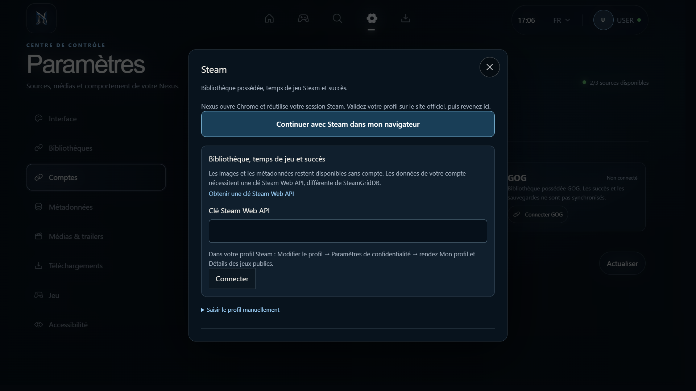

# Nexus — audit des parcours, 4 octobre 2026

## Périmètre et preuves

Parcours réel de 13 jeux locaux, navigateur à 856 × 668, contrôle natif Electron à 1920 × 1080. Les captures locales sont dans `frontend/artifacts/audit/2026-10-04/`. Vérification visuelle, DOM, tests de comportement et IPC ; ce rapport ne constitue pas une certification d’accessibilité. Aucune connexion à un compte réel ni installation de jeu n’a été effectuée.

## Parcours observés

1. **Accueil** — `01-home.jpg` : le rail recouvrait Jouer. Corrigé avec une composition compacte pour les fenêtres basses ; `08-home-fixed.jpg` montre les actions dégagées.
2. **Bibliothèque** — `02-library.jpg` : sources et disponibilité lisibles, mais les commandes du haut occupent beaucoup de place. Proposition : garder Ajouter et Actualiser visibles, regrouper les commandes secondaires ; préserver recherche, plateforme et tri.
3. **Fiche jeu** — `03-game-detail.jpg` : colonnes trop larges, texte coupé. Corrigé par empilement jusqu’à 1100 px avec défilement ; `10-detail-fixed.jpg`.
4. **Recherche** — `04-search.jpg` : toutes les cartes annonçaient Local, même pour Steam. Corrigé pour afficher la source réelle.
5. **Paramètres** — `05-settings.jpg` : boutons de thème coupés. Corrigé avec sections horizontales, contrôles sur une seconde ligne et défilement de la page ; `09-settings-fixed.jpg`.
6. **Comptes** — `06-accounts.jpg` et contrôle natif : le voile du dialogue avait un z-index supérieur au contenu. Corrigé avec surface opaque au-dessus du voile. Steam utilise désormais Chrome (ou le navigateur par défaut si absent), la session existante et le retour OpenID officiel. La liaison du profil et l’accès aux données du compte ont des états distincts.
7. **Téléchargements** — `07-downloads.jpg` : panneaux trop larges. Corrigé par une colonne à largeur moyenne. La gestion d’installation des bibliothèques distantes reste à développer.

## Priorités proposées

| Priorité | Amélioration | Résultat attendu |
| --- | --- | --- |
| P1 | Bibliothèque unifiée : jeux possédés, installés et locaux, rapprochement par identifiants officiels | Une carte par jeu avec choix du lanceur, sans doublons ni faux statut installé |
| P1 | Diagnostic des médias : fournisseur, dernier essai, remplacement ciblé, reprise des échecs | Comprendre et réparer une cover manquante sans relancer toute la bibliothèque |
| P1 | Installation via Steam/Epic/GOG avec progression provenant réellement du client | Éviter une promesse de téléchargement sans suivi réel |
| P2 | Favoris et rangée des jeux récents | Atteindre rapidement les jeux les plus utilisés |
| P2 | Aperçu des succès et temps Steam sur les cartes | Montrer uniquement les données synchronisées, avec date et état de confidentialité |
| P2 | Grille virtualisée et chargement prioritaire des médias visibles | Conserver une navigation fluide avec plusieurs centaines de jeux |
| P2 | Menu contextuel cohérent souris/manette | Personnaliser, réparer les médias, ouvrir le dossier et choisir l’exécutable au même endroit |

## Fiabilité corrigée

Une erreur de chargement de module pouvait laisser un écran vide. Une limite d’erreur conserve la navigation et propose Recharger ou Accueil, sans afficher les détails internes de l’exception.

## Validation

84 tests passent (59 backend, 25 interface). TypeScript et compilation de production passent. Electron confirme les IPC, le stockage chiffré, le rejet des entrées invalides, le dialogue au-dessus du voile, le bouton navigateur actif, le retour du focus et l’annulation Epic. Le flux OpenID est testé avec callback HTTP réel et fournisseur simulé ; l’utilisateur doit encore valider son compte sur Steam pour vérifier sa session Chrome réelle.

La clé SteamGridDB sert aux images. Steam OpenID confirme l’identité ; la bibliothèque, les temps et les succès utilisent une clé Steam Web API et les autorisations du profil. Référence : [Steam — documentation développeur](https://steamcommunity.com/developer/contentguidelines).
