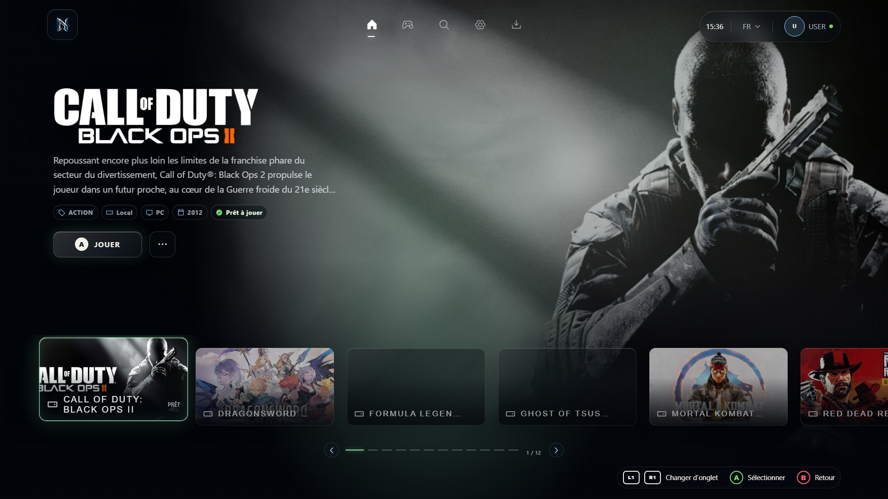
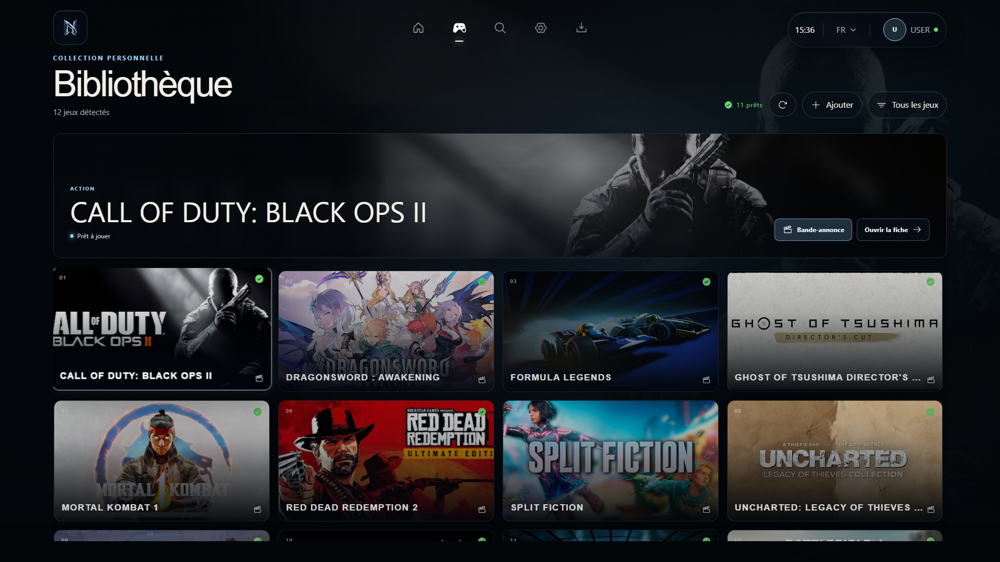
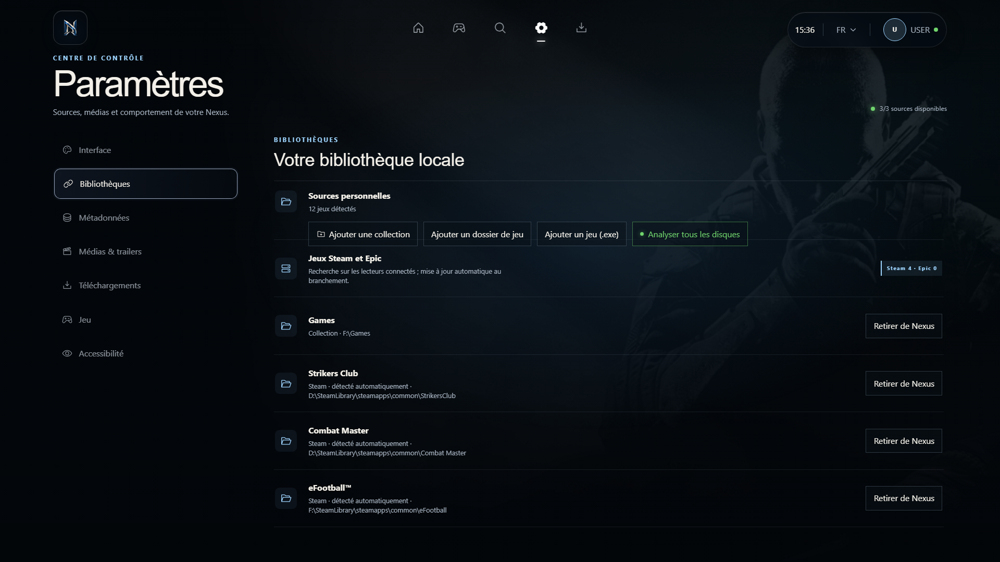

<div align="center">


# Nexus Launcher

**Your PC game library, in one cinematic space.**  
**Tous vos jeux PC dans un espace cinématique.**

[English](#english) · [Français](#français) · [Download V1.0](https://github.com/zamakz641-byte/Nexus-Launcher/releases/tag/v1.0.0)



</div>

## English

Nexus Launcher is a Windows desktop app for browsing and launching games from a visual, controller-friendly library. It finds installed Steam and Epic games, and lets you add any other Windows game by choosing its `.exe` file.

### Highlights

- **One library:** scan connected drives for Steam and Epic installations, add game folders, or pick an individual executable.
- **Game details:** fetch available Steam metadata, artwork, and trailers; correct a game's title to search again.
- **Personal controls:** choose covers and backgrounds, set a SteamGridDB API key in the desktop app, and switch between French and English.
- **Made for the couch:** keyboard and controller navigation, a cinematic home screen, and the restrained “Minimal · tactile” sound set.
- **Playtime:** tracks sessions launched through Nexus. Earlier time played in Steam or Epic is not imported.

<table><tr><td width="50%"></td><td width="50%"></td></tr></table>

### Download and install

1. Open the [V1.0 release](https://github.com/zamakz641-byte/Nexus-Launcher/releases/tag/v1.0.0).
2. Choose **Setup.exe** for an installer or **Portable.exe** to run without installation. Both are for **Windows x64**.
3. Open **Settings → Libraries** to scan drives or add a game with the Windows file picker.

The V1.0 binaries are not code signed; Windows may show a publisher warning. Nexus does not remove game files when you remove an entry from its library.

### Build from source

Requires Node.js and npm on Windows.

```powershell
cd frontend
npm ci
npm run typecheck
npm test
npm run build
npm run desktop
```

To build the Windows executables locally:

```powershell
npm run dist:win
```

The app code lives in `frontend/src` and `frontend/electron`. Local settings and game registrations stay in the user's application data directory. Do not commit `.env.local` or API keys.

### Audio credit

“Minimal · tactile” interface cues use selections from **Universal UI Soundpack** by **Nathan Gibson**, licensed under **CC BY 4.0**. The attribution and license are bundled in [`public/audio/nathan-gibson/LICENSE.txt`](public/audio/nathan-gibson/LICENSE.txt).

---

## Français

Nexus Launcher est une application Windows pour parcourir et lancer vos jeux dans une bibliothèque visuelle adaptée au clavier et à la manette. Elle détecte les jeux Steam et Epic installés et permet d’ajouter n’importe quel jeu Windows en sélectionnant son fichier `.exe`.

### Fonctionnalités

- **Une seule bibliothèque :** analyse des lecteurs connectés, ajout de dossiers et sélection directe d’un exécutable.
- **Fiches de jeu :** métadonnées Steam disponibles, jaquettes et bandes-annonces ; un titre corrigé relance la recherche.
- **Personnalisation :** choix des images, clé SteamGridDB dans l’application de bureau et interface en français ou en anglais.
- **Navigation salon :** clavier, manette, accueil cinématique et sons discrets « Minimal · tactile ».
- **Temps de jeu :** suivi des sessions lancées depuis Nexus. Les heures déjà jouées sur Steam ou Epic ne sont pas importées.

### Télécharger

1. Ouvrez la [release V1.0](https://github.com/zamakz641-byte/Nexus-Launcher/releases/tag/v1.0.0).
2. Choisissez **Setup.exe** pour l’installation ou **Portable.exe** pour lancer Nexus sans installation. Les deux versions sont pour **Windows x64**.
3. Dans **Paramètres → Bibliothèques**, analysez les disques ou sélectionnez le `.exe` d’un jeu.

Les exécutables V1.0 ne sont pas signés ; Windows peut afficher un avertissement d’éditeur inconnu. Retirer un jeu de Nexus ne supprime jamais ses fichiers.

### Développement

Les commandes de construction et de test figurent dans la section [Build from source](#build-from-source). Conservez les clés API dans l’application ou dans un environnement local, jamais dans le dépôt.

